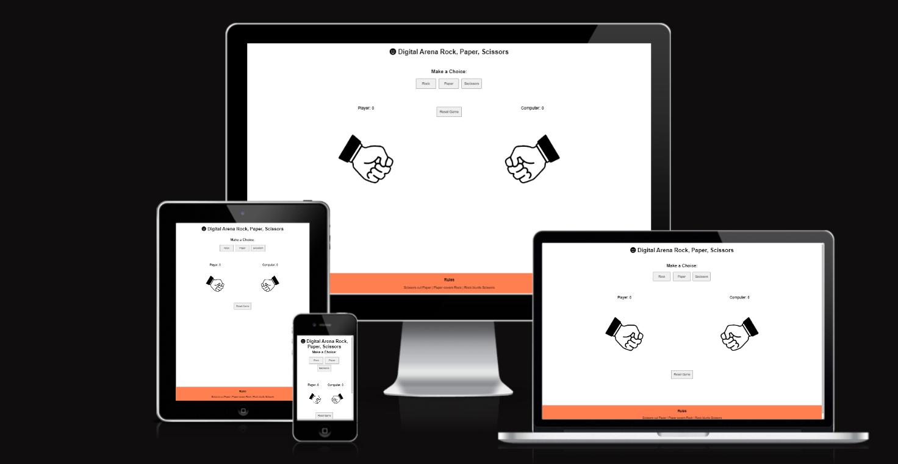
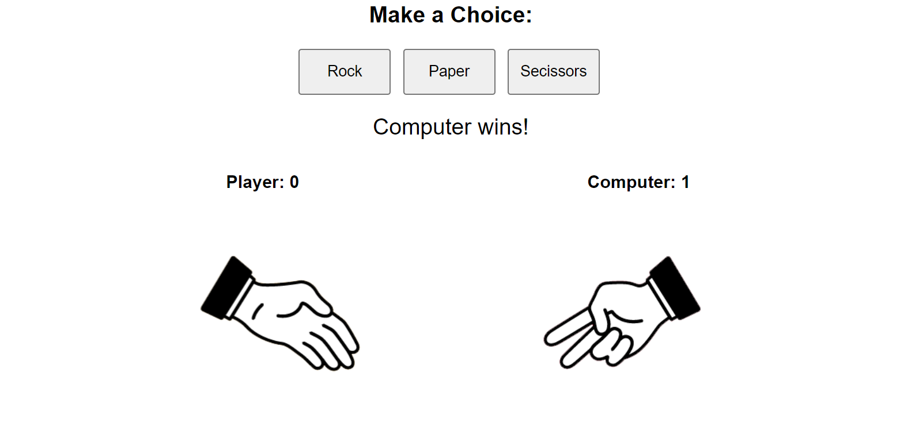
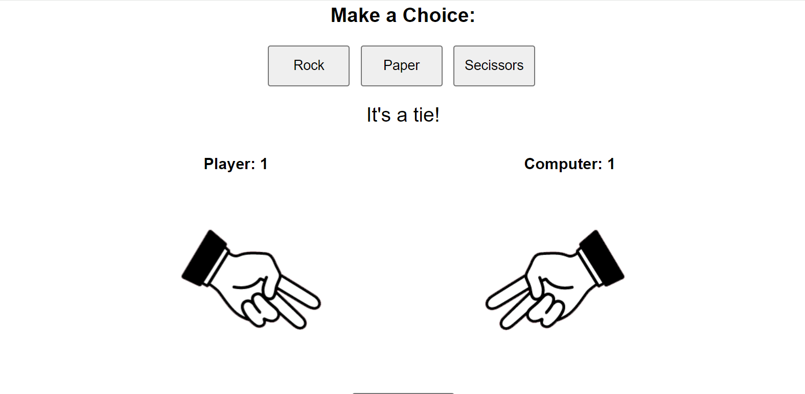
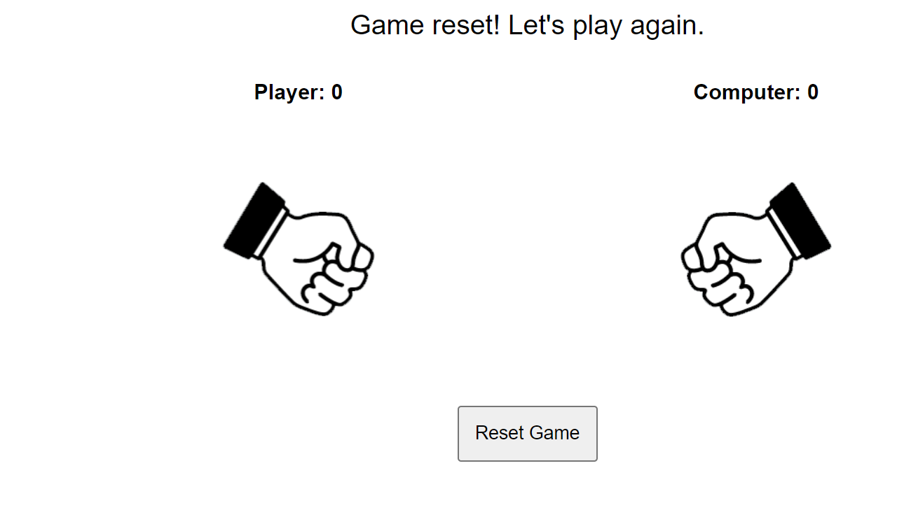
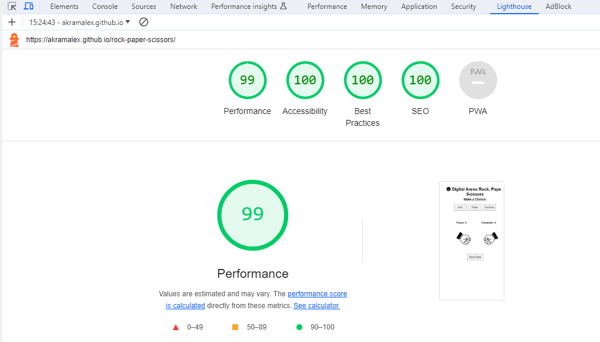

# Digital Arena Rock, Paper, Scissors

## Welcome to the classic game of Digital Arena Rock, Paper, Scissors!  [View the live project here .](https://akramalex.github.io/rock-paper-scissors/)

Welcome to the Digital Arena Rock Paper Scissors – your go-to game for making decisions among friends, colleagues, and family with a dash of digital randomness! This modern take on the classic hand game introduces a computer player that ensures truly random results, making it the ultimate decision-making tool.

## Why Digital Arena?
  
Research indicates that when people are familiar with each other, traditional Rock Paper Scissors games can become predictable, often resulting in draws. In Digital Arena Rock Paper Scissors, the computer player introduces an element of unpredictability, providing statistically fairer and more exciting results compared to traditional hand-play.

## Features 

* At the Top of the Page: Digital Arena Rock Paper Scissors Unveiled!
  
  * Positioned prominently, the header proudly displays the game's name, 'Digital Arena Rock Paper Scissors,' in a playful font that sharply contrasts with the background.
  
  * Enhancing the visual appeal, an iconic symbol for Digital Arena Rock Paper Scissors accompanies the header, capturing the essence of the game at a glance.
  
  * This meticulously crafted header serves as a clear beacon, leaving no room for confusion about the game at play, ensuring users know they are about to engage in the exciting world of Digital Arena Rock Paper Scissors.
  
  * This header clearly tells the user what game they are playing.

## The Game Options

* The Game options include clear instructions followed by a choice of options to play: Rock, Paper, or Scissors. These options are interactive buttons that the user can click to make their choice.

* This section provides interactive buttons that the user can click to make their choice and play the game.

  
 
* Additionally, the excitement begins as soon as the player presses one of these buttons. The game kicks off instantly, revealing the choices made by both the player and the computer. This dynamic initiation adds a thrill to every click, making the gameplay experience even more engaging.

* Additionally, there is behind-the-scenes magic happening with the function playGame. When the player chooses an option, the corresponding image updates to reflect their choice. Simultaneously, the computer's choice option image also updates. As the virtual duel unfolds, the playGame function determines the winner, and a message promptly appears, announcing the victorious outcome. This added layer of engagement enhances the overall gameplay experience, ensuring excitement and suspense until the very end.

  

  ## The Game Results 

  * When the user clicks an option, the image related to their choice is promptly displayed on their side of the game board.

  * Behind the scenes, the JavaScript code springs into action. It randomly selects an option for the Computer player, displays the corresponding image, and then skillfully determines the winner.

  * The victorious outcome is triumphantly announced to the user, appearing just under the options buttons. A skillfully declared message reveals who emerged as the winner in this virtual duel.
 
   * As the cheers settle, the score is diligently updated on the scoreboard. Whether it's a triumph for the user or a win for the computer, the score gets a well-deserved +1 point.

  * The results and score are presented in a clear and user-friendly manner, ensuring that the game is not only easy to play but also easy to follow. Players can quickly understand who won and keep track of the score, making each round of the game a delightful experience.
  
 

 ## Resetting the Game 
In the Digital Arena Rock Paper Scissors game, we understand that a fresh start can be just as exciting as the first play. To provide a seamless experience, we've included a dedicated Reset Game button.
* How it Works:
  
   * Game Score Reset: Clicking the Reset Game button will set the game score back to 0, allowing both players to embark on a new journey of victories.
  
   * Image Reset: The button doesn't just stop at resetting the score; it also gracefully reverts the game images to their initial positions. This ensures a clean slate for the next round.
  
  *  Ready for Round Two:
  
     * With a click of the Reset Game button, a cheerful message greets you: "Game reset! Let's play again." It's an invitation to start afresh, bringing an air of excitement and anticipation for the next series of Rock Paper Scissors showdowns.
   

   
  
## Footer 

* The footer section shows the rules of Rock Paper Scissors.
  
*  The footer is valuable to the user because it clearly explains how the game is played.

## Features Left to Implement or Future Features 

* Multiplayer Mode: Introduce a multiplayer option, allowing users to compete against friends or other players online.
 
* Sound Effects: Add immersive sound effects to enhance the gaming experience, such as unique sounds for each game option and victory announcements.

## Testing

* The game has been tested on different browsers for both desktop and mobile: Chrome, Firefox, Safari

* It has been confirmed all game results work as expect and they are always correct

* It has been confirmed that header, options, buttons, instructions, results and footer text are all readable and easy to understand by users. 
  
* • I confirmed that the colors and fonts chosen are easy to read and accessible by running it through lighthouse in devtools.
  
  

##  bugs 

* No  bugs were found 
   
## Validator Testing

 * HTML
  
   * No errors were returned when passing through the official  [W3C validator .](https://validator.w3.org/nu/?doc=https%3A%2F%2Fakramalex.github.io%2Frock-paper-scissors%2F)

  
* CSS 
  * No errors were found when passing through the official [(Jigsaw) validator.](https://jigsaw.w3.org/css-validator/validator?uri=https%3A%2F%2Fakramalex.github.io%2Frock-paper-scissors%2F&profile=css3svg&usermedium=all&warning=1&vextwarning=&lang=en)

* Javascript 
 
  
  * No errors were found when passing through [JS Hint validator.](https://jshint.com/)

## unfixed bugs 

* No unfixed bugs

## Deployment 

 * The site was deployed to GitHub pages. The steps to deploy are as follows
  
 *  In the GitHub repository, navigate to the Settings tab
  
* From the source section drop-down menu, select the Master Branch

* Once the master branch has been selected, the page provided the link to the completed website.

The live link can be found here  [View the live project here .](https://akramalex.github.io/rock-paper-scissors/)

## Credits 

* Content 

  * Game code was inspired by Love Maths [dreamstime .](https://www.dreamstime.com/free-photos) project - events listener structure with 'data-type' and results functions built based in the project's.

  * The icons used on the game were taken from Font Awesome free icons.[dreamstime .](https://www.dreamstime.com/free-photos)
  
  * The fonts used on the game were taken from Google Fonts.[dreamstime .](https://www.dreamstime.com/free-photos)
  
  * Favicon used on the game was generated in favicon.io. [dreamstime .](https://www.dreamstime.com/free-photos)
* Media
  * The images of the hands were taken from [dreamstime .](https://www.dreamstime.com/free-photos)

